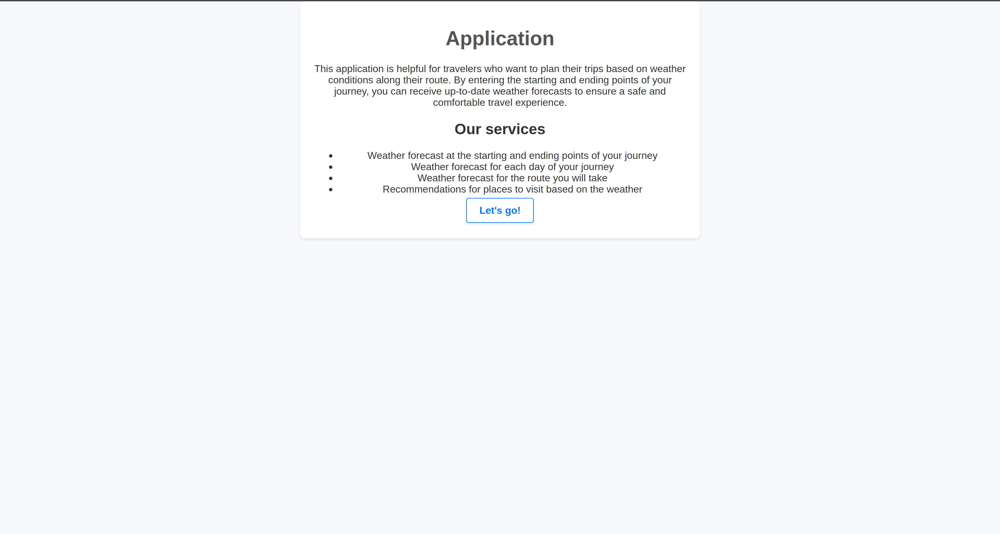
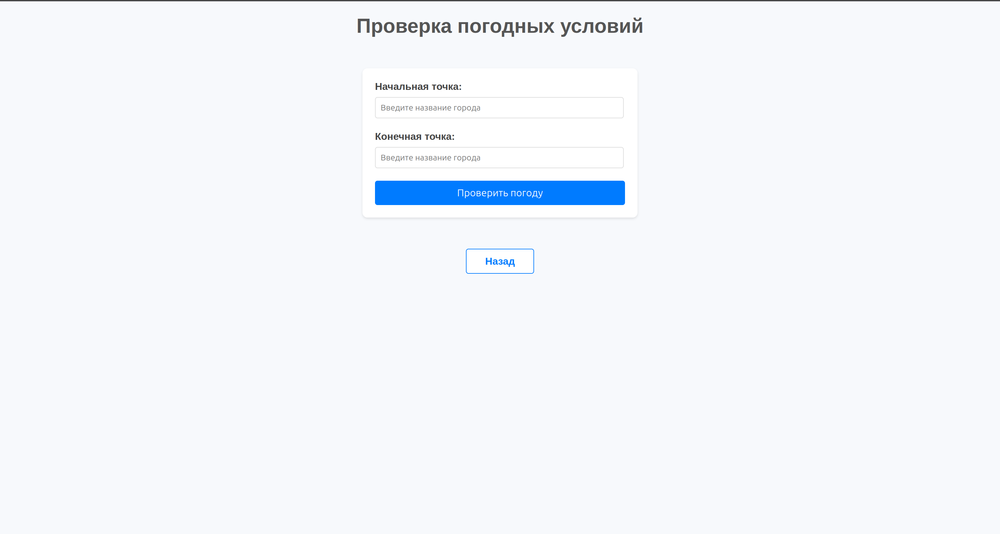
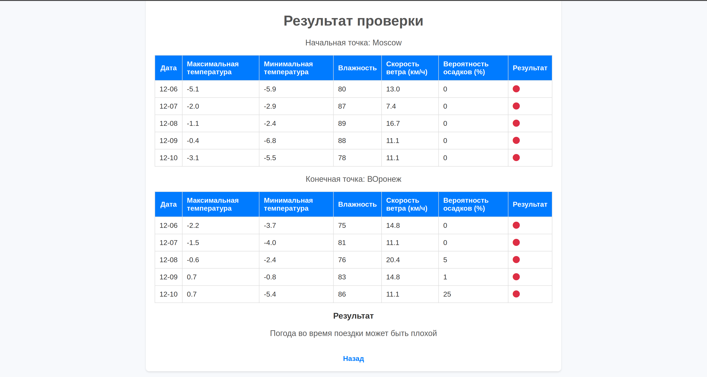
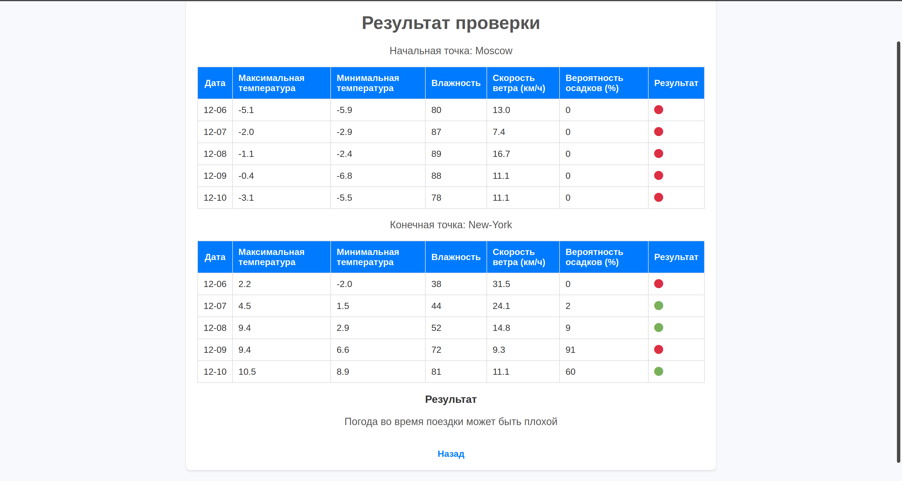

# Weather service

## setting up
```
python3 -m venv .venv
source .venv/bin/activate
python3 app.py
```

## routes
* /
* /check-weather

## Client path
main page


routes page


results page


another result
